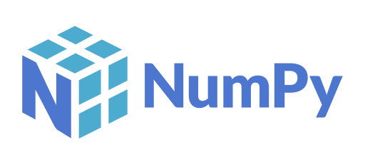
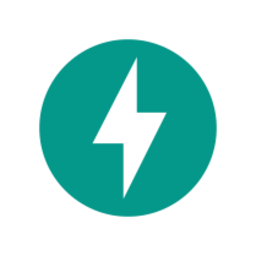

# 🌟 **Muhammad Dawood** 🌟  
**Transforming Data into Impactful Insights**

#### *“Data is the new oil, and I'm here to refine it!”*  
I’m a **Data Scientist** passionate about solving real-world problems through **AI**, **Machine Learning**, and **Deep Learning**.  
Let’s uncover hidden patterns, predict the future, and drive innovation together.

---

  <h2 style="font-weight: bold; font-size: 28px;">🔮 Welcome to My Digital Universe! 🌌</h2>

  

---

## **🚀 What I Bring to the Table**

### 👨‍💻 **Core Expertise**
- **AI Solutions**: Mastery of **Machine Learning**, **Deep Learning**, and **NLP** to solve diverse challenges.
- **Data Analysis**: Crafting actionable insights with tools like **SQL**, **Power BI**, and **Excel**.
- **End-to-End Projects**: Building scalable solutions from **idea to deployment**.

---

<h2>⚡ **Innovative Projects** ⚡</h2>

| **Project**                     | **Description**                                                                                   | **Demo**                                                                                  |
|----------------------------------|---------------------------------------------------------------------------------------------------|------------------------------------------------------------------------------------------|
| 🎬 **Movie Recommendation Engine** | A cutting-edge, personalized movie recommendation system powered by advanced ML models.          | [🎥 Explore Demo](https://movie-recommendation-system-dawood-moria.streamlit.app/)       |
| 🤖 **AI Chatbot**                | An intelligent chatbot leveraging **Dialogflow**, **FastAPI**, and dynamic NLP capabilities.      | *Coming Soon!*                                                                          |
| 📊 **Churn Analysis Dashboard**  | Interactive dashboards that help businesses retain customers by predicting churn behavior.       | *Coming Soon!*                                                                          |

---

## **🌱 Currently Learning**
- Advanced **NLP Techniques**: Transformers, **BERT**, **GPT**, and their real-world applications.
- **Generative AI**: Diving deep into models like **Stable Diffusion** and **GANs**.
- **Time Series Forecasting**: Optimizing predictive capabilities for dynamic datasets.
- **Audio Deep Learning**: Analyzing speech and sound data for AI solutions.

---

<h2>🛠️ **Tools & Technologies I Love** 🛠️</h2>

    
    
    
    
    
    
    
    
    

---

## 🎯 **My Vision**
- Lead AI research in **Generative Models** and **Forecasting Techniques**.
- Build AI-driven solutions that **empower businesses** and improve lives.
- Collaborate with global communities to advance open-source AI projects.

---

<h2>📬 **Let’s Get in Touch!** 📬</h2>

---

  <h3>✨ *Thank you for stopping by!* ✨</h3>
  
Feel free to connect for collaborations, AI discussions, or just a quick chat about data science. 😊

