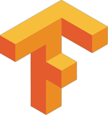
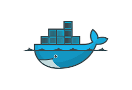
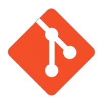

  <h1>👋 Welcome to My Digital Lab – I’m Muhammad Dawood!</h1>
  <h3>Data Scientist | AI Engineer | Creator of Intelligent Solutions</h3>
  

  

  

    
  

## 🌌 **About Me**

  

I'm a **Data Scientist** passionate about **AI**, **Machine Learning**, **Deep Learning**, and **NLP**. Every project here focuses on making **AI solutions smarter** and **data-driven decisions better**.

Fun Fact: When I’m not coding, I explore new libraries, participate in hackathons, and share knowledge about AI!

  <h2> 🚀 **Projects Portfolio** 🚀 </h2>

### **Featured Projects**

<table align="center" style="width:100%; table-layout:fixed;">
  <tr>
    <td align="center" width="300" style="padding: 20px;">
      

        
      

      <h3>🎬 Movie Recommendation System</h3>
      
Personalized movie recommendations using collaborative filtering.

      
    </td>
    <td align="center" width="300" style="padding: 20px;">
      

        
      

      <h3>AI-Powered Banking Fraud Detection 🚀</h3>
      
Predict and visualize customer churn with this interactive dashboard.

      
    </td>
  </tr>
  <tr>
    <td align="center" width="300" style="padding: 20px;">
      

        
      

      <h3>🤖 AI Chatbot</h3>
      
Advanced NLP-driven chatbot for real-time customer interaction.

      Coming Soon!
    </td>
    <td align="center" width="300" style="padding: 20px;">
      

        
      

      <h3>📈 Time Series Forecasting</h3>
      
Analyze and forecast trends using advanced time series models.

      Coming Soon!
    </td>
  </tr>
</table>

  <h2> 🛠️ **Technologies & Tools** 🛠️ </h2>

    
    
    
    

## 🌱 **Currently Exploring**

- **Advanced NLP with Transformers**: Working with **BERT**, **GPT**, and **T5** models for next-gen NLP tasks.
- **Generative AI and GANs**: Exploring creative applications with generative models.
- **Time Series Forecasting**: Using **LSTM** and **ARIMA** to predict future trends and insights.

  <h2>📬 **Connect with Me** 📬</h2>
  
Let’s collaborate on projects, discuss AI innovations, or share knowledge!

  
  
  

  
✨ **Thanks for stopping by! Let’s push boundaries with data!** ✨

