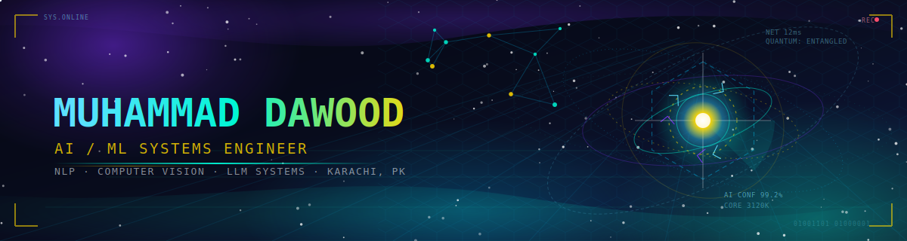
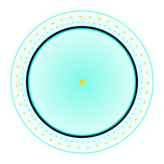

<div align="center">



<br/>

<table border="0" cellborder="0" cellspacing="0">
<tr>
<td width="240" align="center" valign="middle">

</td>
<td align="left" valign="middle">

<a href="https://git.io/typing-svg">
  
</a>

<br/><br/>


<a href="https://github.com/muhammadmoria?tab=followers"></a>


</td>
</tr>
</table>

</div>

<br/>


<!-- ============================ ABOUT ============================ -->

## 🧬 &nbsp;System Overview

<div align="center">
<i>"Innovation is not just a goal — it's a mindset."</i>
</div>

<br/>

<table width="100%">
<tr>
<td width="25%" valign="top" align="center">

### 🎯 Mission
Turn raw data and ambiguous problems into deployed, reliable AI systems — not notebooks that never ship.

</td>
<td width="25%" valign="top" align="center">

### 🔮 Vision
A practice built on applied NLP, CV, and LLM engineering that clients trust with production stakes.

</td>
<td width="25%" valign="top" align="center">

### ⚙️ Current Focus
Enterprise Django systems (ERP UI/UX), LLM-powered document pipelines, and applied ML tooling.

</td>
<td width="25%" valign="top" align="center">

### 🧭 Engineering Principle
Preserve what already works. Elevate everything else. Never break the logic to chase the aesthetic.

</td>
</tr>
</table>


- 🔭 Currently building **client-facing AI/ML tools and enterprise-grade web systems**
- 🤖 Focused on **NLP, Computer Vision, and Generative AI** with real-world deployment paths
- 🌐 Delivering **full-stack + AI-integrated products** — from data pipeline to polished UI
- 📄 Regularly engineering **document-generation pipelines** (PDF, DOCX) for professional/academic use
- 📍 Based in **Karachi, Pakistan**
- 💬 Ask me about **LLM app architecture, ML deployment, or Django system design**

<br/>

<!-- ============================ TECH STACK ============================ -->

## 🧠 &nbsp;Technology Modules

<div align="center">

**⟨ AI &nbsp;/&nbsp; MACHINE LEARNING CORE ⟩**
<br/>


<br/><br/>

**⟨ BACKEND &nbsp;/&nbsp; APPLICATION LAYER ⟩**
<br/>


<br/><br/>

**⟨ FRONTEND &nbsp;/&nbsp; INTERFACE LAYER ⟩**
<br/>


<br/><br/>

**⟨ DATA &nbsp;/&nbsp; CLOUD &nbsp;/&nbsp; DEVOPS ⟩**
<br/>


</div>


<!-- ============================ PROJECTS ============================ -->

## 🚀 &nbsp;Project Showcase

<table width="100%">
<tr>
<td width="50%" valign="top">


Smart movie recommendation engine using embeddings and collaborative filtering.

`Python` `Streamlit` `Embeddings`

[](https://movie-recommendation-system-dawood-moria.streamlit.app/)

</td>
<td width="50%" valign="top">


Real-time fraud detection engine built for secure banking transaction systems.

`Python` `ML Classification` `Security`

[](https://ai-fraud-detector-for-banking-system-by-dawood-moria.streamlit.app/)

</td>
</tr>
<tr>
<td width="50%" valign="top">


End-to-end platform automating Machine Learning & Deep Learning workflows.

`Python` `AutoML` `Jupyter`

[](https://data-science-app-by-dawood-moria.streamlit.app/)

</td>
<td width="50%" valign="top">


Historical stock data retrieval with predictive analytics for smarter decisions.

`Python` `Time Series` `Analytics`

[](https://stockflow.streamlit.app/)

</td>
</tr>
<tr>
<td width="50%" valign="top">


AI-powered sentiment analysis engine built for customer feedback at scale.

`NLP` `TensorFlow` `Sentiment Analysis`

[](https://aquasentix.streamlit.app/)

</td>
<td width="50%" valign="top">


Analytics platform that translates dense medical reports into plain-language insight.

`NLP` `Healthcare AI` `Document Parsing`

[](https://health-report-analyzer.streamlit.app/)

</td>
</tr>
</table>


<!-- ============================ ANALYTICS ============================ -->

## 📊 &nbsp;Analytics Center

<div align="center">


<br/>


<br/>


</div>

<details>
<summary><b>🏆 &nbsp;Trophy Case (click to expand)</b></summary>
<br/>
<div align="center">

</div>
</details>

<details>
<summary><b>🐍 &nbsp;Contribution Snake (optional — one-time setup)</b></summary>
<br/>

GitHub doesn't let a README run code on its own, but the animated contribution snake is generated by a scheduled **GitHub Action** in this same repository. Add this workflow once at `.github/workflows/snake.yml`:

```yaml
name: generate-snake
on:
  schedule:
    - cron: "0 0 * * *"
  workflow_dispatch: {}
  push:
    branches: [ main ]

jobs:
  generate:
    runs-on: ubuntu-latest
    steps:
      - uses: Platane/snk@v3
        with:
          github_user_name: muhammadmoria
          outputs: |
            dist/github-contribution-grid-snake.svg
            dist/github-contribution-grid-snake-dark.svg?palette=github-dark
      - uses: crazy-max/ghaction-github-pages@v4
        with:
          target_branch: output
          build_dir: dist
        env:
          GITHUB_TOKEN: ${{ secrets.GITHUB_TOKEN }}
```

Then embed it here:

```md

```

</details>


<!-- ============================ CONNECT ============================ -->

## 🌐 &nbsp;Connect

<div align="center">

[](https://muhammadmoria.github.io/Portfolio--/)
[](mailto:muhammaddawoodmoria@gmail.com)
[](https://github.com/muhammadmoria)

</div>


