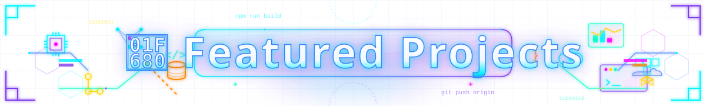
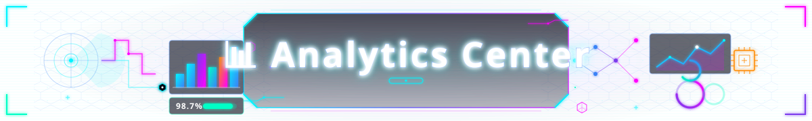
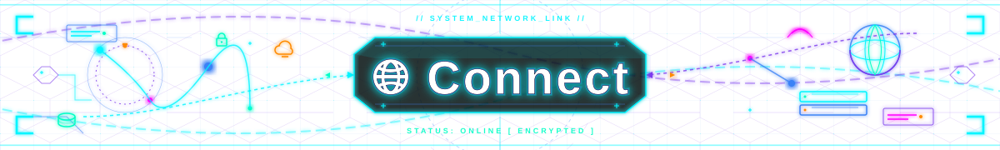

 

<!-- PREMIUM PROJECT SHOWCASE -->

  

<table width="100%">

<tr>

<td width="50%" valign="top">

### 🎬 CineMancer

Smart Movie Recommendation Engine using embeddings and collaborative filtering.

**Tech Stack**

- Python
- Streamlit
- Embeddings

</td>

<td width="50%" valign="top">

### 🛡 DefrauderAI

Real-time fraud detection engine for banking transactions.

**Tech Stack**

- Python
- Machine Learning
- Security

</td>

</tr>

<tr>

<td width="50%" valign="top">

### ⚡ AutoMLX

Automated Machine Learning & Deep Learning platform.

**Tech Stack**

- Python
- AutoML
- Jupyter

</td>

<td width="50%" valign="top">

### 📈 StockFlow

Historical stock analytics with predictive insights.

**Tech Stack**

- Python
- Time Series
- Analytics

</td>

</tr>

<tr>

<td width="50%" valign="top">

### 💬 AquaSentix

AI-powered sentiment analysis for customer feedback.

**Tech Stack**

- NLP
- TensorFlow
- Sentiment Analysis

</td>

<td width="50%" valign="top">

### 🏥 Health Report Analyzer

AI-powered medical report interpretation platform.

**Tech Stack**

- NLP
- Healthcare AI
- Document Parsing

</td>

</tr>

</table>

---

  

  
  <!-- BOTTOM PREMIUM BANNER -->
  

    
More AI Projects Coming Soon

    
Currently architecting next-generation intelligent systems.

  

