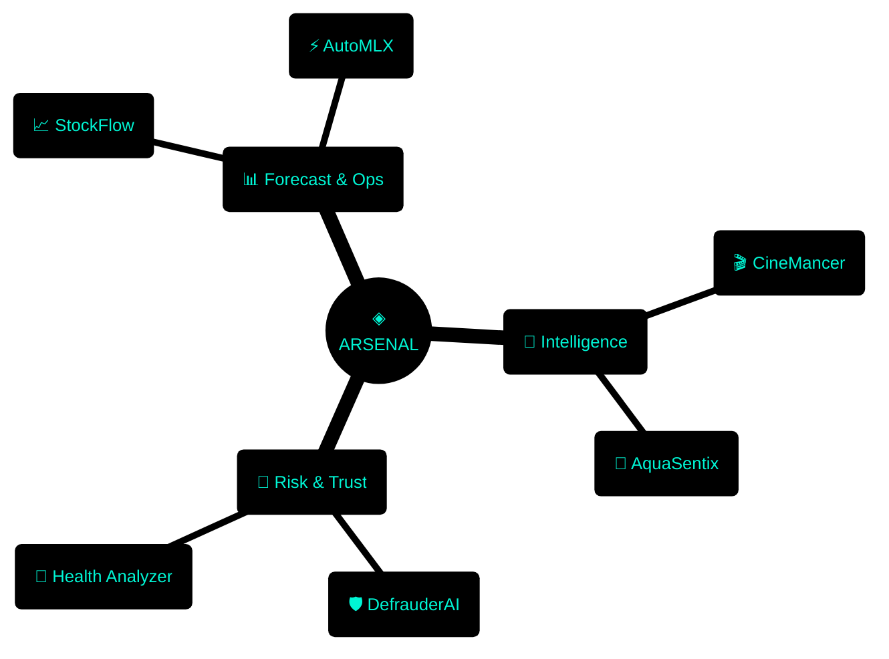
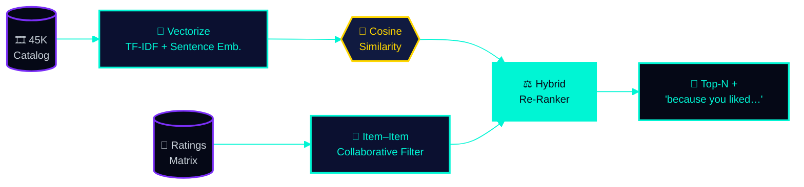
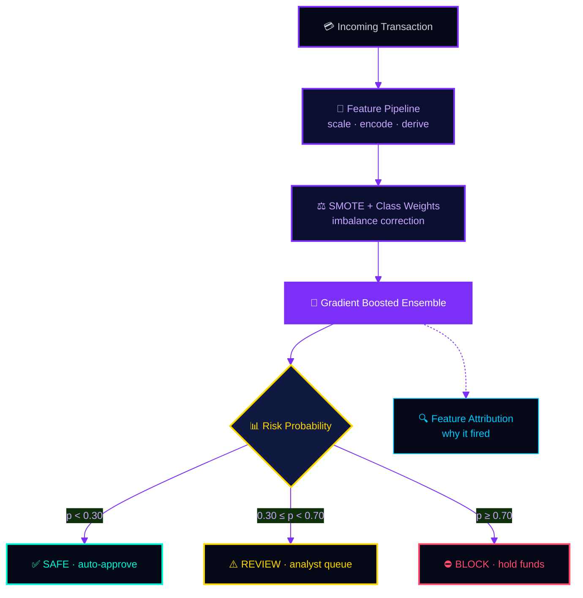
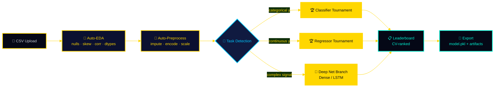
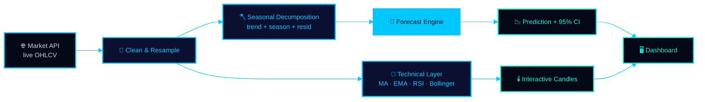
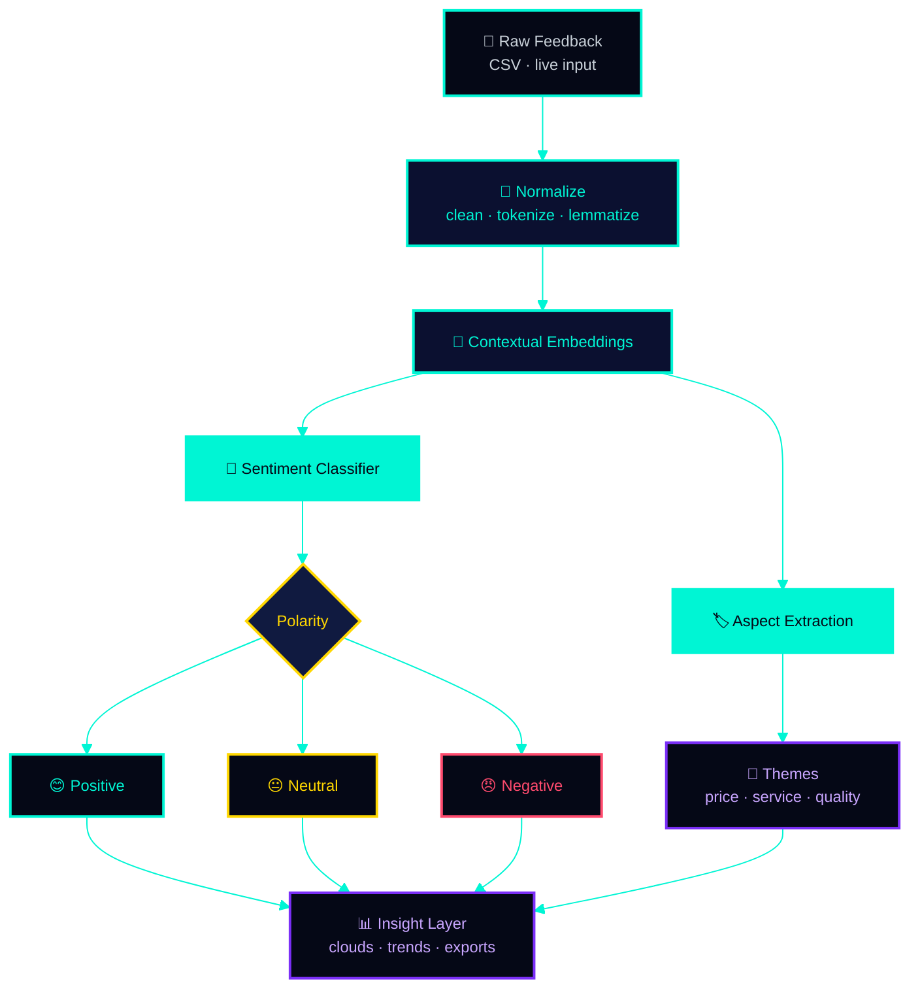
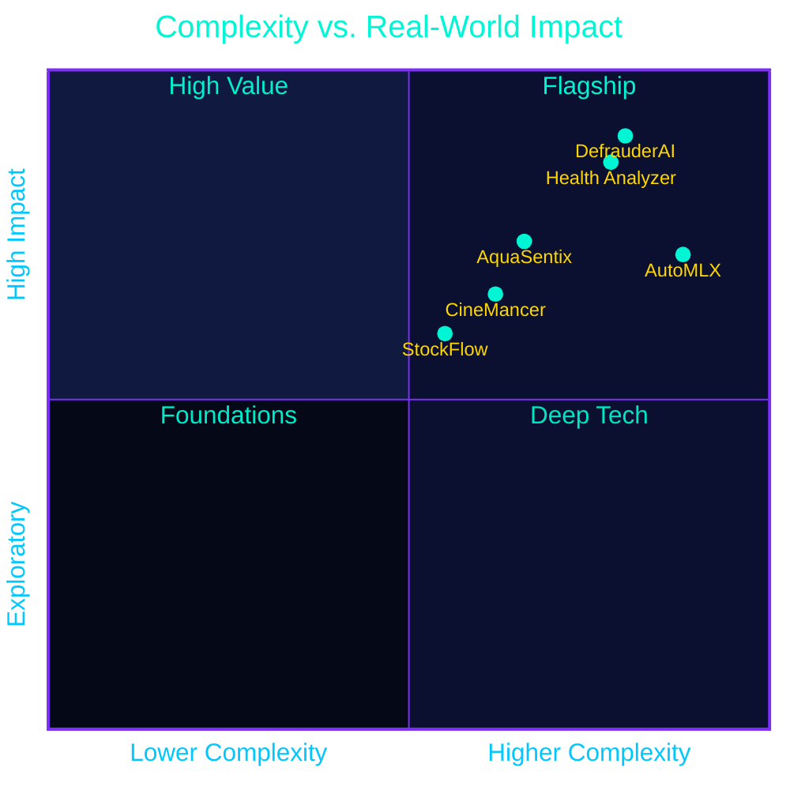

 

<!-- PREMIUM PROJECT SHOWCASE -->

  

<!--
╔══════════════════════════════════════════════════════════════════════════╗
║   ██████╗ ██████╗  ██████╗      ██╗███████╗ ██████╗████████╗███████╗    ║
║   ██╔══██╗██╔══██╗██╔═══██╗     ██║██╔════╝██╔════╝╚══██╔══╝██╔════╝    ║
║   ██████╔╝██████╔╝██║   ██║     ██║█████╗  ██║        ██║   ███████╗    ║
║   ██╔═══╝ ██╔══██╗██║   ██║██   ██║██╔══╝  ██║        ██║   ╚════██║    ║
║   ██║     ██║  ██║╚██████╔╝╚█████╔╝███████╗╚██████╗   ██║   ███████║    ║
║   ╚═╝     ╚═╝  ╚═╝ ╚═════╝  ╚════╝ ╚══════╝ ╚═════╝   ╚═╝   ╚══════╝    ║
╚══════════════════════════════════════════════════════════════════════════╝
-->

  

  
  
  
  

 

## ◈ &nbsp;Navigation Grid

|  |  |  |
|:-:|:-:|:-:|
|  `recommender systems` |  `financial security` |  `automl platform` |
|  `time series` |  `natural language` |  `medical document ai` |

 

### The map

```mermaid
%%{init: {'theme':'base','themeVariables':{'primaryColor':'#050816','primaryTextColor':'#00F5D4','primaryBorderColor':'#7B2FF7','lineColor':'#7B2FF7','fontFamily':'JetBrains Mono','fontSize':'13px'}}}%%
mindmap
  root(("◈<br/>ARSENAL"))
    ("🧠 Intelligence")
      ("🎬 CineMancer")
      ("💬 AquaSentix")
    ("🔐 Risk & Trust")
      ("🛡 DefrauderAI")
      ("🏥 Health Analyzer")
    ("📊 Forecast & Ops")
      ("📈 StockFlow")
      ("⚡ AutoMLX")
```

 

## CineMancer

> **Every film becomes a point in latent space.** Ask for one you loved, and CineMancer returns its nearest neighbours — then re-ranks them against what people with your taste actually watched next.

  
  
  
  

```mermaid
%%{init: {'theme':'base','themeVariables':{'primaryColor':'#0B1030','primaryTextColor':'#00F5D4','primaryBorderColor':'#00F5D4','lineColor':'#00F5D4','secondaryColor':'#101A40','tertiaryColor':'#050816','fontFamily':'JetBrains Mono','fontSize':'12px'}}}%%
flowchart LR
    A[("🎞️ 45K<br/>Catalog")]:::src --> B["🧬 Vectorize<br/>TF-IDF + Sentence Emb."]:::proc
    U[("👥 Ratings<br/>Matrix")]:::src --> C["🤝 Item–Item<br/>Collaborative Filter"]:::proc
    B --> D{{"📐 Cosine<br/>Similarity"}}:::dec
    D --> E["⚖️ Hybrid<br/>Re-Ranker"]:::core
    C --> E
    E --> F["🎯 Top-N +<br/>'because you liked…'"]:::out

    classDef src fill:#050816,stroke:#7B2FF7,stroke-width:2px,color:#C9D1D9
    classDef proc fill:#0B1030,stroke:#00F5D4,stroke-width:2px,color:#00F5D4
    classDef dec fill:#101A40,stroke:#FFD700,stroke-width:2px,color:#FFD700
    classDef core fill:#00F5D4,stroke:#00F5D4,stroke-width:3px,color:#050816
    classDef out fill:#050816,stroke:#00F5D4,stroke-width:2px,color:#00F5D4
```

<table>
<tr><td width="50%" valign="top">

**⚙️ Engineering notes**

`▸` Hybrid scoring — content vectors fused with interaction signal
`▸` Cold-start neutralised via pure-content fallback path
`▸` Similarity matrix precomputed, cached with `st.cache_resource`
`▸` Explainability trace attached to every recommendation

</td><td width="50%" valign="top">

**📊 At a glance**

| Metric | Value |
|:--|:--|
| Catalog size | `45,000+` |
| Response time | `< 200 ms` |
| Approach | `Hybrid CF + Content` |
| Status | `🟢 Live` |

</td></tr>
</table>

> [!TIP]
> Try an obscure title — the content branch handles films with almost no rating history, which is where most recommenders collapse.

  
  &nbsp;
  

 

## DefrauderAI

> **0.17% of transactions are fraud. Missing them is expensive; flagging good ones is worse.** DefrauderAI scores every transaction the instant it lands and routes it into a decision band instead of a blunt yes/no.

  
  
  
  

```mermaid
%%{init: {'theme':'base','themeVariables':{'primaryColor':'#0B1030','primaryTextColor':'#C9A6FF','primaryBorderColor':'#7B2FF7','lineColor':'#7B2FF7','fontFamily':'JetBrains Mono','fontSize':'12px'}}}%%
flowchart TD
    A["💳 Incoming Transaction"]:::src --> B["🧹 Feature Pipeline<br/>scale · encode · derive"]:::proc
    B --> C["⚖️ SMOTE + Class Weights<br/>imbalance correction"]:::proc
    C --> D["🌲 Gradient Boosted Ensemble"]:::core
    D --> E{"📊 Risk Probability"}:::dec
    E -->|"p &lt; 0.30"| F["✅ SAFE · auto-approve"]:::ok
    E -->|"0.30 ≤ p &lt; 0.70"| G["⚠️ REVIEW · analyst queue"]:::warn
    E -->|"p ≥ 0.70"| H["⛔ BLOCK · hold funds"]:::bad
    D -.-> I["🔍 Feature Attribution<br/>why it fired"]:::note

    classDef src fill:#050816,stroke:#7B2FF7,stroke-width:2px,color:#C9D1D9
    classDef proc fill:#0B1030,stroke:#7B2FF7,stroke-width:2px,color:#C9A6FF
    classDef core fill:#7B2FF7,stroke:#7B2FF7,stroke-width:3px,color:#FFFFFF
    classDef dec fill:#101A40,stroke:#FFD700,stroke-width:2px,color:#FFD700
    classDef ok fill:#050816,stroke:#00F5D4,stroke-width:2px,color:#00F5D4
    classDef warn fill:#050816,stroke:#FFD700,stroke-width:2px,color:#FFD700
    classDef bad fill:#050816,stroke:#FF4B6E,stroke-width:2px,color:#FF4B6E
    classDef note fill:#050816,stroke:#00C8FF,stroke-width:1px,color:#00C8FF
```

<table>
<tr><td width="50%" valign="top">

**⚙️ Engineering notes**

`▸` Synthetic oversampling + cost-sensitive learning on extreme imbalance
`▸` Threshold tuning optimised for recall-at-fixed-precision, not accuracy
`▸` Three-tier routing keeps analyst workload bounded
`▸` Batch CSV ledger scoring *and* single-transaction sandbox

</td><td width="50%" valign="top">

**📊 At a glance**

| Metric | Value |
|:--|:--|
| ROC-AUC | `0.98` |
| Positive rate | `0.17%` |
| Decision bands | `3` |
| Status | `🟢 Live` |

</td></tr>
</table>

> [!IMPORTANT]
> Accuracy is a meaningless metric here — a model that predicts "not fraud" every time scores 99.83%. This one is tuned on recall and AUC.

  
  &nbsp;
  

 

## AutoMLX

> **The whole modelling loop, minus the code.** Upload a dataset and AutoMLX profiles it, cleans it, runs a full tournament of algorithms, ranks them by cross-validated score, and hands back a pickled pipeline.

  
  
  
  

```mermaid
%%{init: {'theme':'base','themeVariables':{'primaryColor':'#0B1030','primaryTextColor':'#FFD700','primaryBorderColor':'#FFD700','lineColor':'#FFD700','fontFamily':'JetBrains Mono','fontSize':'12px'}}}%%
flowchart LR
    A["📂 CSV Upload"]:::src --> B["🔬 Auto-EDA<br/>nulls · skew · corr · dtypes"]:::proc
    B --> C["🧽 Auto-Preprocess<br/>impute · encode · scale"]:::proc
    C --> D{"🎯 Task Detection"}:::dec
    D -->|categorical y| E["🏆 Classifier Tournament"]:::core
    D -->|continuous y| F["🏆 Regressor Tournament"]:::core
    D -->|complex signal| G["🧠 Deep Net Branch<br/>Dense / LSTM"]:::core
    E --> H["📋 Leaderboard<br/>CV-ranked"]:::out
    F --> H
    G --> H
    H --> I["💾 Export<br/>model.pkl + artifacts"]:::out

    classDef src fill:#050816,stroke:#FFD700,stroke-width:2px,color:#C9D1D9
    classDef proc fill:#0B1030,stroke:#FFD700,stroke-width:2px,color:#FFD700
    classDef dec fill:#101A40,stroke:#00C8FF,stroke-width:2px,color:#00C8FF
    classDef core fill:#FFD700,stroke:#FFD700,stroke-width:3px,color:#050816
    classDef out fill:#050816,stroke:#00F5D4,stroke-width:2px,color:#00F5D4
```

<table>
<tr><td width="50%" valign="top">

**⚙️ Engineering notes**

`▸` Task type inferred from target cardinality and dtype
`▸` 15+ estimators benchmarked under identical CV folds
`▸` Preprocessing fitted inside the pipeline — no leakage
`▸` One-click export bundles transformer + estimator together

</td><td width="50%" valign="top">

**📊 At a glance**

| Metric | Value |
|:--|:--|
| Models swept | `15+` |
| Code required | `none` |
| Deep learning | `included` |
| Status | `🟢 Live` |

</td></tr>
</table>

  
  &nbsp;
  

 

## StockFlow

> **Price is one series hiding three.** StockFlow pulls live OHLCV, splits it into trend, seasonality and residual, then projects forward with an uncertainty band instead of a false-confidence single line.

  
  
  
  

```mermaid
%%{init: {'theme':'base','themeVariables':{'primaryColor':'#0B1030','primaryTextColor':'#00C8FF','primaryBorderColor':'#00C8FF','lineColor':'#00C8FF','fontFamily':'JetBrains Mono','fontSize':'12px'}}}%%
flowchart LR
    A["🌐 Market API<br/>live OHLCV"]:::src --> B["🧾 Clean & Resample"]:::proc
    B --> C["📐 Technical Layer<br/>MA · EMA · RSI · Bollinger"]:::proc
    B --> D["🪓 Seasonal Decomposition<br/>trend + season + resid"]:::proc
    D --> E["🔮 Forecast Engine"]:::core
    E --> F["📉 Prediction + 95% CI"]:::out
    C --> G["🕯️ Interactive Candles"]:::out
    F --> H["🖥️ Dashboard"]:::out
    G --> H

    classDef src fill:#050816,stroke:#00C8FF,stroke-width:2px,color:#C9D1D9
    classDef proc fill:#0B1030,stroke:#00C8FF,stroke-width:2px,color:#00C8FF
    classDef core fill:#00C8FF,stroke:#00C8FF,stroke-width:3px,color:#050816
    classDef out fill:#050816,stroke:#00F5D4,stroke-width:2px,color:#00F5D4
```

<table>
<tr><td width="50%" valign="top">

**⚙️ Engineering notes**

`▸` Live ingestion — nothing static, nothing stale
`▸` Confidence intervals surfaced, never hidden
`▸` Multi-ticker normalised overlay for relative performance
`▸` Fully interactive Plotly canvas with zoom + range selectors

</td><td width="50%" valign="top">

**📊 At a glance**

| Metric | Value |
|:--|:--|
| Coverage | `global tickers` |
| Horizon | `1 – 365 days` |
| Output | `point + interval` |
| Status | `🟢 Live` |

</td></tr>
</table>

> [!WARNING]
> Built for analysis and education. Forecast bands describe model uncertainty, not market reality — this is not investment advice.

  
  &nbsp;
  

 

## AquaSentix

> **Knowing customers are unhappy is useless. Knowing *what* they're unhappy about is the product.** AquaSentix classifies polarity and then mines the aspect driving it.

  
  
  
  

```mermaid
%%{init: {'theme':'base','themeVariables':{'primaryColor':'#0B1030','primaryTextColor':'#00F5D4','primaryBorderColor':'#00F5D4','lineColor':'#00F5D4','fontFamily':'JetBrains Mono','fontSize':'12px'}}}%%
flowchart TD
    A["💬 Raw Feedback<br/>CSV · live input"]:::src --> B["🧼 Normalize<br/>clean · tokenize · lemmatize"]:::proc
    B --> C["🔡 Contextual Embeddings"]:::proc
    C --> D["🧠 Sentiment Classifier"]:::core
    C --> E["🏷️ Aspect Extraction"]:::core
    D --> F{"Polarity"}:::dec
    F --> G["😊 Positive"]:::ok
    F --> H["😐 Neutral"]:::warn
    F --> I["😠 Negative"]:::bad
    E --> J["📌 Themes<br/>price · service · quality"]:::out
    G --> K["📊 Insight Layer<br/>clouds · trends · exports"]:::out
    H --> K
    I --> K
    J --> K

    classDef src fill:#050816,stroke:#00F5D4,stroke-width:2px,color:#C9D1D9
    classDef proc fill:#0B1030,stroke:#00F5D4,stroke-width:2px,color:#00F5D4
    classDef core fill:#00F5D4,stroke:#00F5D4,stroke-width:3px,color:#050816
    classDef dec fill:#101A40,stroke:#FFD700,stroke-width:2px,color:#FFD700
    classDef ok fill:#050816,stroke:#00F5D4,stroke-width:2px,color:#00F5D4
    classDef warn fill:#050816,stroke:#FFD700,stroke-width:2px,color:#FFD700
    classDef bad fill:#050816,stroke:#FF4B6E,stroke-width:2px,color:#FF4B6E
    classDef out fill:#050816,stroke:#7B2FF7,stroke-width:2px,color:#C9A6FF
```

<table>
<tr><td width="50%" valign="top">

**⚙️ Engineering notes**

`▸` Three-class polarity with calibrated confidence, not raw softmax
`▸` Aspect mining separates *sentiment* from *subject*
`▸` Sentiment-over-time curves expose regressions after releases
`▸` Annotated CSV export drops straight into a BI tool

</td><td width="50%" valign="top">

**📊 At a glance**

| Metric | Value |
|:--|:--|
| Macro F1 | `0.94` |
| Classes | `3` |
| Modes | `bulk + live` |
| Status | `🟢 Live` |

</td></tr>
</table>

  
  &nbsp;
  

 

## Health Analyzer

> **A lab report is data the patient can't read.** This pipeline extracts biomarkers, compares them against reference ranges, and explains what's outside the lines — in language that doesn't require a medical degree.

  
  
  
  

```mermaid
%%{init: {'theme':'base','themeVariables':{'primaryColor':'#0B1030','primaryTextColor':'#C9A6FF','primaryBorderColor':'#7B2FF7','lineColor':'#7B2FF7','fontFamily':'JetBrains Mono','fontSize':'12px'}}}%%
flowchart LR
    A["📄 Upload<br/>PDF · JPG · PNG"]:::src --> B{"Digital or Scanned?"}:::dec
    B -->|digital| C["📑 Text Layer Extract"]:::proc
    B -->|scanned| D["👁️ OCR Engine"]:::proc
    C --> E["🏷️ Entity Recognition<br/>biomarker · value · unit"]:::core
    D --> E
    E --> F["📏 Reference Range Match"]:::proc
    F --> G{"In Range?"}:::dec
    G -->|yes| H["✅ Normal"]:::ok
    G -->|no| I["🚩 Flagged + Context"]:::bad
    H --> J["📝 Plain-English Summary"]:::out
    I --> J
    J --> K["🔒 Memory-only · nothing stored"]:::note

    classDef src fill:#050816,stroke:#7B2FF7,stroke-width:2px,color:#C9D1D9
    classDef proc fill:#0B1030,stroke:#7B2FF7,stroke-width:2px,color:#C9A6FF
    classDef core fill:#7B2FF7,stroke:#7B2FF7,stroke-width:3px,color:#FFFFFF
    classDef dec fill:#101A40,stroke:#FFD700,stroke-width:2px,color:#FFD700
    classDef ok fill:#050816,stroke:#00F5D4,stroke-width:2px,color:#00F5D4
    classDef bad fill:#050816,stroke:#FF4B6E,stroke-width:2px,color:#FF4B6E
    classDef out fill:#050816,stroke:#00C8FF,stroke-width:2px,color:#00C8FF
    classDef note fill:#050816,stroke:#00F5D4,stroke-width:1px,color:#00F5D4
```

<table>
<tr><td width="50%" valign="top">

**⚙️ Engineering notes**

`▸` Dual-path ingestion — native text layer or OCR fallback
`▸` Layout-aware parsing survives multi-column lab tables
`▸` Unit normalisation before any range comparison
`▸` Zero retention — processed in memory, never written to disk

</td><td width="50%" valign="top">

**📊 At a glance**

| Metric | Value |
|:--|:--|
| Inputs | `PDF · IMG` |
| Extraction | `OCR + NER` |
| Data retention | `none` |
| Status | `🟢 Live` |

</td></tr>
</table>

> [!CAUTION]
> This is an informational and educational tool. It does not diagnose, and it is never a substitute for a qualified clinician reviewing your results.

  
  &nbsp;
  

 

## ◈ &nbsp;Arsenal Matrix

| # | System | Domain | Core Stack | Signature Metric | Live |
|:-:|:--|:--|:--|:-:|:-:|
| `01` | **CineMancer** | Recommender Systems | `Embeddings` `CF` `Streamlit` | ⚡ `<200ms` | [**↗ open**](https://movie-recommendation-system-dawood-moria.streamlit.app/) |
| `02` | **DefrauderAI** | Financial Security | `XGBoost` `SMOTE` `Pandas` | 🎯 `0.98 AUC` | [**↗ open**](https://ai-fraud-detector-for-banking-system-by-dawood-moria.streamlit.app/) |
| `03` | **AutoMLX** | AutoML Platform | `AutoML` `Keras` `Jupyter` | 🏆 `15+ models` | [**↗ open**](https://data-science-app-by-dawood-moria.streamlit.app/) |
| `04` | **StockFlow** | Time-Series Forecasting | `Prophet` `Plotly` `yfinance` | 📈 `365d horizon` | [**↗ open**](https://stockflow.streamlit.app/) |
| `05` | **AquaSentix** | Natural Language | `TensorFlow` `HF` `spaCy` | 💬 `0.94 F1` | [**↗ open**](https://aquasentix.streamlit.app/) |
| `06` | **Health Analyzer** | Medical Document AI | `OCR` `NER` `PyPDF` | 🔒 `0 retention` | [**↗ open**](https://health-report-analyzer.streamlit.app/) |

 

### Where the work sits

```mermaid
%%{init: {'theme':'base','themeVariables':{'primaryColor':'#0B1030','primaryTextColor':'#00F5D4','primaryBorderColor':'#7B2FF7','lineColor':'#7B2FF7','fontFamily':'JetBrains Mono','fontSize':'12px','quadrant1Fill':'#0B1030','quadrant2Fill':'#101A40','quadrant3Fill':'#050816','quadrant4Fill':'#0B1030','quadrantTitleFill':'#00F5D4','quadrantPointFill':'#00F5D4','quadrantPointTextFill':'#FFD700','quadrantXAxisTextFill':'#00C8FF','quadrantYAxisTextFill':'#00C8FF','quadrantInternalBorderStrokeFill':'#7B2FF7','quadrantExternalBorderStrokeFill':'#7B2FF7'}}}%%
quadrantChart
    title Complexity vs. Real-World Impact
    x-axis "Lower Complexity" --> "Higher Complexity"
    y-axis "Exploratory" --> "High Impact"
    quadrant-1 "Flagship"
    quadrant-2 "High Value"
    quadrant-3 "Foundations"
    quadrant-4 "Deep Tech"
    "CineMancer": [0.62, 0.66]
    "DefrauderAI": [0.80, 0.90]
    "AutoMLX": [0.88, 0.72]
    "StockFlow": [0.55, 0.60]
    "AquaSentix": [0.66, 0.74]
    "Health Analyzer": [0.78, 0.86]
```

 

  
  
  
  

  

---

  

  
  <!-- BOTTOM PREMIUM BANNER -->
  

    
More AI Projects Coming Soon

    
Currently architecting next-generation intelligent systems.

  

