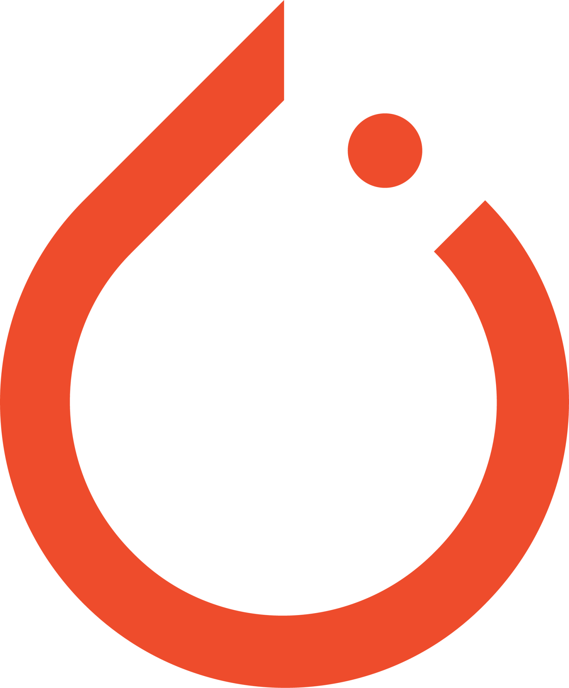

# 👋 Welcome to My World  
## **I’m Muhammad Dawood, Your Data Science Partner in Innovation**  
🌟 **Turning Complex Data into Intuitive Solutions** 🌟

---

  

    
  

---

  <h2 style="font-size: 32px; font-weight: bold;">🚀 Your Data Science Journey Begins Here!</h2>

  Welcome! I’m a passionate <strong>Data Scientist</strong> leveraging the power of <strong>AI</strong>, <strong>Machine Learning</strong>, and <strong>Deep Learning</strong> to solve real-world problems.  
  My goal? To revolutionize industries with cutting-edge AI solutions.  

---

### **🌌 Explore My Universe of Projects**

  <table>
    <tr>
      <td align="center" width="300">
        
        <h3 style="margin-top: 10px;">🎬 Movie Recommendation System</h3>
        
An ML-powered app to personalize movie recommendations.

        
      </td>
      <td align="center" width="300">
        
        <h3 style="margin-top: 10px;">🤖 AI Chatbot</h3>
        
An intelligent chatbot built with Dialogflow and FastAPI.

        Coming Soon!
      </td>
      <td align="center" width="300">
        
        <h3 style="margin-top: 10px;">📊 Churn Analysis Dashboard</h3>
        
A dashboard to predict and visualize customer churn insights.

        Coming Soon!
      </td>
    </tr>
  </table>

---

<h2 style="font-size: 28px;">🛠️ Tools & Technologies</h2>

  
  
  
  
  
  
  
  

---

### ✨ **Why Work with Me?**

- **Innovative Thinker**: I thrive on solving complex problems with creative solutions.
- **AI Pioneer**: From predictive models to conversational AI, I specialize in impactful solutions.
- **Collaborative Spirit**: Teamwork drives my ability to create value in diverse industries.

---

<h2>🌟 Let’s Collaborate and Create Something Exceptional!</h2>

  
  
  

---

  
💡 *"Thank you for visiting my profile. Let's innovate together!"*

