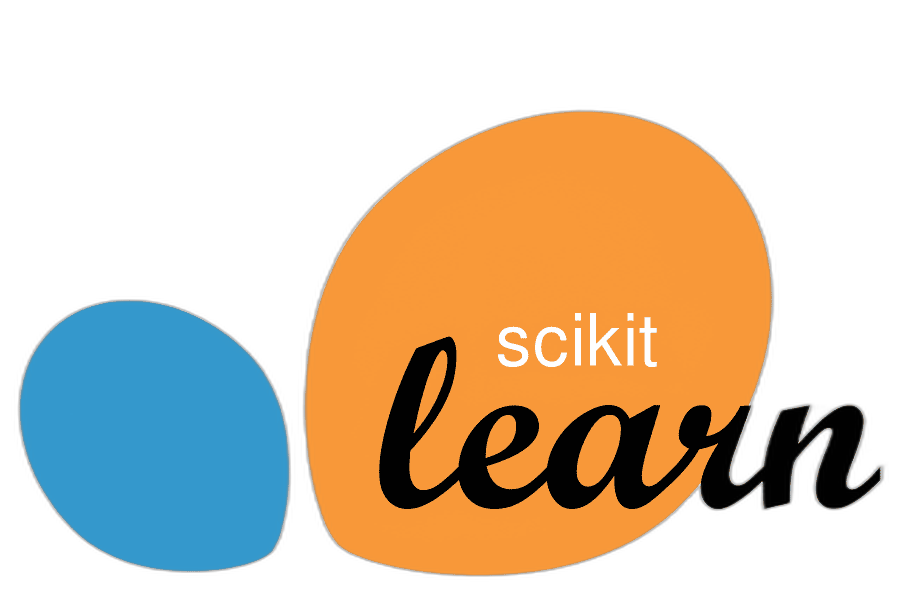

<!---
Muhammad Dawood/Muh]ammad Dawood is a ✨ special ✨ repository because its `README.md` (this file) appears on your GitHub profile.
You can click the Preview link to take a look at your changes.
--->

# Hi there, I'mMuhammad Dawood 👋
  
I'm an aspiring **Data Scientist** passionate about using data to uncover hidden insights and solve real-world problems. Welcome to my GitHub profile, where I showcase my projects, skills, and interests in the fields of **Data Science**, **Machine Learning**, **Deep Learning**, and more! 

## I'm a Data Scientist! 
    
---

### 🔭 Current Focus
I am currently working as a **Data Scientist** and actively looking for new opportunities to contribute my skills. Whether it's using machine learning to optimize processes, developing predictive models, or generating insights from complex datasets, I'm ready to tackle new challenges. 

### 🌱 What I'm Learning
- Deep diving into **Data Science** techniques, exploring advanced topics like **Computer Vision**, **Natural Language Processing (NLP)**, and **Time Series Analysis**.
- Expanding my knowledge in **Audio Deep Learning** and **Satellite Image Segmentation**.
- Continuously improving my skills with **Deep Learning** frameworks such as TensorFlow and PyTorch.

### 🧠 Expertise
- **Data Analysis**: I have experience in analyzing datasets for business insights and decision-making using tools like **Power BI**, **MS Excel**, and **SQL**.
- **Machine Learning**: Skilled in building classification, regression, and clustering models using **Scikit-learn** and **XGBoost**.
- **NLP**: Proficient in **NLP** techniques, including **Tokenization**, **POS Tagging**, **Stemming**, **Lemmatization**, **NER**, and various text representation methods (e.g., **Bag of Words**, **TF-IDF**, **Word Embeddings**).
- **Transformers and Language Models**: Experienced in working with **Transformers**, including **GPT**, **BERT**, and their variants, for advanced **NLP** tasks like text classification, question answering, and language generation.
- **Customer Churn Analysis**: Conducted analysis for **customer churn** using **Power BI**, helping businesses make informed decisions.
- **Chatbot Development**: Built a chatbot using **Dialogflow** and **FastAPI**, handling backend logic, intent management, and MySQL database integration.
- **Reinforcement Learning**: Familiar with **UCB** and **Thompson Sampling** algorithms, applied to decision-making problems.
- **Clustering Techniques**: Experience in **K-Means** clustering and **Eclat** for customer segmentation and market basket analysis.
- **Recommendation Systems**: Worked on recommendation system projects, gaining a deep understanding of user behavior and personalized suggestions.

### 🥅 Goals
- Conduct research in **Cutting-Edge AI** fields, particularly in **Time Series Forecasting**, **NLP**, and **Generative AI**.
- Contribute to open-source **AI projects**.
- Build impactful, real-world applications with **Machine Learning**, **Deep Learning**, and **AI** to solve business problems.
- Collaborate with AI communities to advance shared learning.

### ⚡ Fun Fact
I’m a huge coding enthusiast. When I'm not training machine learning models, you'll often find me experimenting with new libraries and frameworks, participating in hackathons, or teaching others about AI.

---

## 💻 Technologies and Tools I Use

I am proficient in a variety of programming languages, frameworks, and tools that help me solve complex data science problems and build efficient solutions.

    <table align="center">
        <tr>
            <td align="center" width="140" height="112.43">
                
                  Python
            </td>
            <td align="center" width="140" height="112.43">
                
                  Jupyter Notebooks
            </td>
            <td align="center" width="140" height="112.43">
                
                  TensorFlow
            </td>
            <td align="center" width="140" height="112.43">
                
                  Scikit Learn
            </td>
            <td align="center" width="140" height="112.43">
                
                  FastAPI
            </td>
            <td align="center" width="140" height="112.43">
                
                  Docker
            </td>
        </tr>
        <tr>
            <td align="center" width="140" height="112.43">
                
                  PyTorch
            </td>
            <td align="center" width="140" height="112.43">
                
                  NumPy
            </td>
            <td align="center" width="140" height="112.43">
                
                  Pandas
            </td>
            <td align="center" width="140" height="112.43">
                
                  SQL
            </td>
            <td align="center" width="140" height="112.43">
                
                  Power BI
            </td>
            <td align="center" width="140" height="112.43">
                
                  Git
            </td>
        </tr>
    </table>

---

Feel free to explore projects in my repositories!

---

<b>My GitHub Stats</b>

## 🌐 Connect with Me
- LinkedIn: [Muhammad Dawood](https://www.linkedin.com/in/muhammaddawood361510306/)
- GitHub: [Muhammad Dawood](https://github.com/muhammadmoria)
- Portfolio: [My Portfolio](https://muhammadmoria.github.io/portfolio-new/)

---

***Thanks for visiting my profile! Feel free to reach out if you'd like to collaborate or chat about anything related to AI, Data Science, or coding.*** 😊
